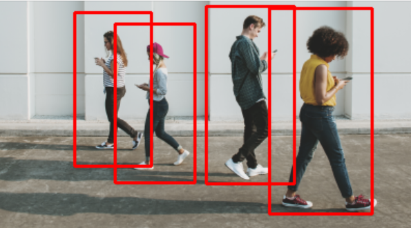
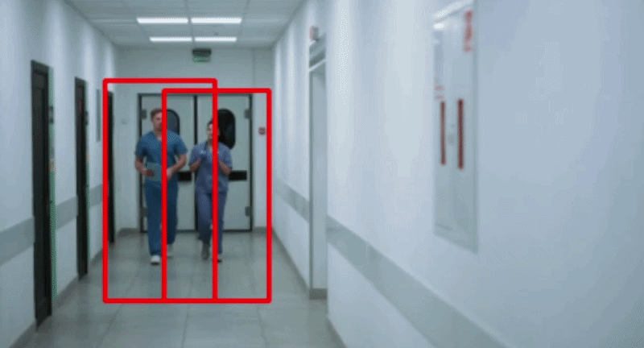

# Deteksi Pejalan Kaki menggunakan OpenCV-Python

OpenCV adalah pustaka sumber terbuka yang ditujukan untuk visi komputer waktu nyata. Pustaka ini dikembangkan oleh Intel dan bersifat lintas platform - dapat mendukung Python, C++, Java, dll. Visi Komputer adalah bidang ilmu komputer mutakhir yang bertujuan untuk memungkinkan komputer memahami apa yang dilihat dalam sebuah gambar. OpenCV adalah salah satu pustaka yang paling banyak digunakan untuk tugas-tugas Visi Komputer seperti pengenalan wajah, deteksi gerakan, deteksi objek, dll. Dalam tutorial ini, kita akan membangun Detektor Pejalan Kaki dasar untuk gambar dan video menggunakan OpenCV. Deteksi pejalan kaki adalah bidang penelitian yang sangat penting karena dapat meningkatkan fungsionalitas sistem perlindungan pejalan kaki di Mobil Otonom. Kita dapat mengekstrak fitur seperti kepala, dua lengan, dua kaki, dll., dari gambar tubuh manusia dan meneruskannya untuk melatih model pembelajaran mesin. Setelah pelatihan, model dapat digunakan untuk mendeteksi dan melacak manusia dalam gambar dan aliran video. Namun, OpenCV memiliki metode bawaan untuk mendeteksi pejalan kaki. Aplikasi ini memiliki model HOG (Histogram of Oriented Gradients) + Linear SVM yang telah dilatih sebelumnya untuk mendeteksi pejalan kaki dalam gambar dan aliran video.

## Histogram Gradien Berorientasi

Algoritma ini memeriksa langsung piksel di sekitar setiap piksel. Tujuannya adalah untuk memeriksa seberapa gelap piksel saat ini dibandingkan dengan piksel di sekitarnya. Algoritma ini menggambar panah yang menunjukkan arah gambar yang semakin gelap. Proses ini diulang untuk setiap piksel dalam gambar. Pada akhirnya, setiap piksel akan digantikan oleh panah, panah-panah ini disebut Gradien . Gradien ini menunjukkan aliran cahaya dari terang ke gelap. Dengan menggunakan gradien ini, algoritma melakukan analisis lebih lanjut. Untuk mempelajari lebih lanjut tentang HOG, baca makalah penelitian Navneet Dalal dan Bill Triggs tentang HOG untuk Deteksi Manusia.

### Persyaratan

`opencv-python 3.4.2`
`imutils 0.5.3`

Untuk menginstal modul-modul di atas, ketik perintah berikut di
terminal.

`pip install opencv-python 3.4.2`
`pip instal imutils 0.5.3`

### Contoh 1:
Mari kita buat program untuk mendeteksi pejalan kaki dalam sebuah gambar:

```py
import cv2
import imutils
# Menginisialisasi orang HOG
# detektor
hog = cv2.HOGDescriptor()
hog.setSVMDetector(cv2.HOGDescriptor_getDefaultPeopleDetector())
# Membaca Gambar
image = cv2.imread('img.png')
# Mengubah ukuran gambar
image = imutils.resize(image,
                            width=min(400, image.shape[1]))
# Mendeteksi semua wilayah di
# Gambar yang memiliki pejalan kaki di dalamnya
(regions, _) = hog.detectMultiScale(image,
                                    winStride=(4, 4),
                                    padding=(4, 4),
                                    scale=1.05)
# Menggambar wilayah dalam Gambar
for (x, y, w, h) in regions:
    cv2.rectangle(image, (x, y),
                  (x + w, y + h),
                  (0, 0, 255), 2)
# Menampilkan Gambar keluaran
cv2.imshow("Image", image)
cv2.waitKey(0)
cv2.destroyAllWindows()
```

Output:



### Contoh 2:
Mari kita buat program untuk mendeteksi pejalan kaki dalam sebuah video:

```py
import cv2
import imutils
# Menginisialisasi orang HOG
# detektor
hog = cv2.HOGDescriptor()
hog.setSVMDetector(cv2.HOGDescriptor_getDefaultPeopleDetector())
cap = cv2.VideoCapture('vid.mp4')
while cap.isOpened():
    # Membaca streaming video
    ret, image = cap.read()
    if ret:
        image = imutils.resize(image,
                                width=min(400, image.shape[1]))
        # Mendeteksi semua wilayah
        # dalam Gambar yang dimiliki
        # pejalan kaki di dalamnya
        (regions, _) = hog.detectMultiScale(image,
                                            winStride=(4, 4),
                                            padding=(4, 4),
                                            scale=1.05)
        # Menggambar wilayah di
        # Gambar
        for (x, y, w, h) in regions:
            cv2.rectangle(image, (x, y),
                          (x + w, y + h),
                          (0, 0, 255), 2)
        # Menampilkan Gambar keluaran
        cv2.imshow("Image", image)
        if cv2.waitKey(25) & 0xFF == ord('q'):
            break
    else:
        break
cap.release()
cv2.destroyAllWindows()
```

Output:

